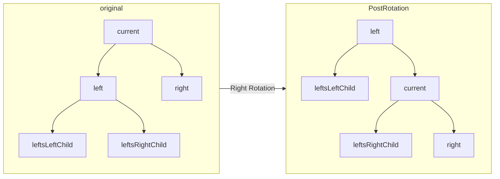

# AVL Trees Lab
- East Tennessee State University
- Department of Computing
- CSCI-2210 (Data Structures)
- Mr. Gillenwater
## Summary
AVL trees are a type of self-balancing binary search tree. They are often useful when you need to search through large quantities of data. They are also reasonably efficient at insertions and deletions.

| Action | Runtime Complexity |
| -- | -- |
| Search | O(logN) |
| Insert | O(logN) |
| Delete | O(logN) |

The main constraint of an AVL tree is that the height of any two subtrees of any node differ by at most one. Following this results in equivalent performance to a complete binary search tree.

## Node Definition
```CSharp
internal class AvlTreeNode<T> where T : IComparable<T>
    {
        internal T Data { get; set; }
        internal AvlTreeNode<T>? Left { get; set; }
        internal AvlTreeNode<T>? Right { get; set; }
        internal int Height { get; set; }

        internal AvlTreeNode(T data)
        {
            this.Data = data;
            this.Height = 0;
        }

        internal void UpdateHeight()
        {
            // Recall that the height of a node in a tree 
            // is exactly one higher than its highest child node.
            int leftChildHeight = this.Left?.Height ?? -1;

            int leftChildHeight;
            if(this.Left == null)
            {
                leftChildHeight = -1;
            }  
            if(this.Left != null)
            {
                leftChildHeight = this.Left.Height;
            }


            int rightchildHeight = this.Right?.Height ?? -1;
            int highestChild = Math.Max(leftChildHeight, rightchildHeight);
            this.Height = highestChild + 1;
        }

        internal int GetBalanceFactor()
        {
            // See implementation details below...
        }
    }
```

## Balance Factor
The Balance Factor of a node refers to the difference in height of the left and right subtree.
```CSharp
int rightHeight = 0;
int leftHeight = 0;
if(this.Right != null)
    rightHeight = this.Right.Height;
if(this.Left != null)
    leftHeight = this.Left.Height;
int BalanceFactor = rightHeight - leftHeight;
return BalanceFactor;
```
Keeping the balance factor between `-1` and `+1` inclusive is how we satisfy the constraint.

## AVL Tree Definition
An AVL Tree implements everything found in a typical [ICollection<T>](https://learn.microsoft.com/en-us/dotnet/api/system.collections.generic.icollection-1), and by extension [IEnumerable<T>](https://learn.microsoft.com/en-us/dotnet/api/system.collections.generic.ienumerable-1). It is common to also include pre-, in-, and post- order traversals. You will need to overload the `Add()` and `Remove()` methods to also accept a root node to recursively perform these operations.

Below is a C# implementation of how to add a node to a binary search tree without the additional AVL considerations. 
```CSharp
private AvlTreeNode<T> Add(AvlTreeNode<T> root, T data) 
{
    if (root == null)
    {
        root = new AvlTreeNode<T>(data);
    }
    else if (data.CompareTo(root.Data) < 0)
    {
        root.Left = Add(root.Left, data);
    }
    else if (data.CompareTo(root.Data) > 0)
    {
        root.Right = Add(root.Right, data);
    }
    return root;
}
```

Below is a C# implementation of how to remove a node to a binary search tree without the additional AVL considerations. 

```CSharp
public AvlTreeNode<T>? Remove(AvlTreeNode<T> root, T data) 
{
    // Is the root node null?
    // we've reached the bottom of the tree
    if (root == null) return null;
    
    if (data.CompareTo(root.Data) < 0)
    {
        // Take a left
        root.Left = Remove(root.Left, data);
    }
    else if (data.CompareTo(root.Data) > 0)
    {
        // Take a right
        root.Right = Remove(root.Right, data);
    }
    // We found the data
    else
    {
        // Determine which of the 3 cases has occurred
        // leaf node
        if (root.Left == null && root.Right == null)
        {
            root = null;
        }
        // Has right child
        // OR Has two children
        else if (root.Right != null)
        {
            // Deal with the child on the right
            var successor = SuccessorSearch(root);
            root.Data = successor.Data;
            root.Right = Remove(root.Right, successor.Data);
        }
        // Has left child
        else if (root.Left != null)
        {
            // Deal with the child on the left
            var predecessor = PredecessorSearch(root);
            root.Data = predecessor.Data;
            root.Left = Remove(root.Left, predecessor.Data);
        }
    }
    
    return root;
}
```

 You can find implementations of successor and predecessor search below.
 ```CSharp
 public AvlTreeNode<T>? SuccessorSearch(AvlTreeNode<T> root) 
{
    var currentNode = root.Right;
    while (currentNode.Left != null)
        currentNode = currentNode.Left;
    return currentNode;
}
```
```CSharp
public AvlTreeNode<T>? PredecessorSearch(AvlTreeNode<T> root)
{
    var currentNode = root.Left;
    while (currentNode.Right != null)
        currentNode = currentNode.Right;
    return currentNode;
}
 ```

## AVL Tree Rotations
Rotations allow us to maintain the balance of the AVL tree. Rotations come in two main flavors: left and right rotations. A right rotations pulls down on the right node, pulling the left node up. A left rotation pulls down on the left node, pulling the right node up.

```Mermaid
graph LR;
    subgraph PostRotation;
        id10["current"];
        id20["left"];
        id30["rightsLeftChild"];
        id40["rightsRightChild"];
        id50["right"];
        id50 --> id10;
        id50 --> id40;
        id10 --> id20;
        id10 --> id30;
    end;

    subgraph original;
        id1["current"];
        id2["left"];
        id3["rightsLeftChild"];
        id4["rightsRightChild"];
        id5["right"];
        id1 --> id2;
        id1 --> id5;
        id5 --> id3;
        id5 --> id4;
    end;

    original --Left Rotation--> PostRotation;
```
 



### Right Rotation
```Mermaid
flowchart TD
    id1["RotateRight(Node node)"] -->
    id2["Store left child in temp variable"] -->
    id3["node.Left := node.Left.Right"] -->
    id4["Update current node's height"] -->
    id5["Update original left child's height"] -->
    id6["Return original left child"]
```
### Left Rotation

```Mermaid
flowchart TD
    id1["RotateLeft(Node node)"] -->
    id2["Store right child in temp variable"] -->
    id3["node.Right := node.Right.Left"] -->
    id4["Update current node's height"] -->
    id5["Update original right child's height"] -->
    id6["Return original right child"]
```

### When To Rotate

We want to rebalance the tree whenever our constraint is no longer satisfied. Recall that our constraint is that the balance factor of a give node needs to be no more than ± 1.

There are 4 ways this constraint can be broken. 
1. Node's Left's Left child is causing the unbalance.
2. Node's Left's Right child is causing the unbalance.
3. Node's Right's Left child is causing the unbalance.
4. Node's Right's Right child is causing the unbalance.

```Mermaid
flowchart TD
    leftHeavy{"balanceFactor < -1"}
    case1Check{"Left.BalanceFactor <= 0"}
    rightHeavy{"balanceFactor > 1"}
    case3Check{"Right.BalanceFactor >= 0"}
    case1["Case 1"]
    case2["Case 2"]
    case3["Case 3"]
    case4["Case 4"]
    header["Rebalance(Node)"]
    return["Return node"]

    header --> leftHeavy
    leftHeavy -- True --> case1Check
    case1Check -- True --> case1
    case1Check -- False --> case2
    leftHeavy -- False --> rightHeavy
    rightHeavy -- True --> case3Check
    case3Check -- True --> case3
    case3Check -- False --> case4
    case1 --> rightHeavy
    case2 --> rightHeavy
    rightHeavy -- False --> return
    case3 --> return
    case4 --> return
```

### How to Rotate
Which you've determined which case to use, perform the rotations according to this chart:

| Case | Rotations to Rebalance the Tree |
| -- | -- |
| 1 | Rotate this node to the right. |
| 2 | Rotate this node's left child to the left. Then rotate this node to the right.|
| 3 | Rotate this node to the left. |
| 4 | Rotate this node's right child to the right. Then rotate this node to the left.

## Updating Our Binary Search Tree
Now that we know how to rebalance our AVL tree, we need to update our `Add()` and `Remove()` methods to take advantage of these improvements.

We can update our Add Method like so.
```CSharp
private AvlTreeNode<T> Add(AvlTreeNode<T> root, T data)
{
    // Use the same code as before to insert into the tree.
    var node = BST_Add(root, data);
    node.UpdateHeight();
    return Rebalance(node);
}
```

We update our remove method in a similar way.
```CSharp
private AvlTreeNode<T> Remove(AvlTreeNode<T> root, T data)
{
    // Use the same code as before to insert into the tree.
    var node = BST_Remove(root, data);

    // Return null if the tree doesn't contain the node.
    // This check relies on the BST_Remove() method behaving
    // correctly, and returning null if the tree doesn't contain
    // the node.
    if(node == null) return null;

    // Update the height and rebalance just like when adding a new node to the tree.
    node.UpdateHeight();
    return Rebalance(node);
}
```

# Congrats!
Thats the end of this lesson. If you've followed along and implemented the flow charts and code snippets correctly, you will have successfully implemented an AVL tree.
